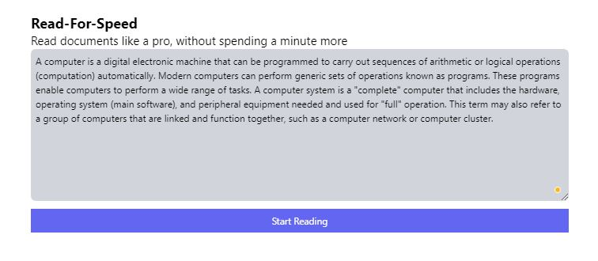

# Read-For-Speed [WIP]

Tired of reading your large essays? or books even? well speed up your process of reading with "Read-For-Speed"!

## **Current (master) state Preview:**

### Stack Used

- Tailwind css for styling
- Next.js and react.js hooks api

### Current Features

- Read documents by manually adding text
- Toggling the act of Reading, i.e. start and stop reading

### Future Features

- [] Reading from online and local pdf files
- [] Importing hashnode blogs
- [] Going back in time 10/5 seconds to capture missed words

### **More Features Coming Soon**
